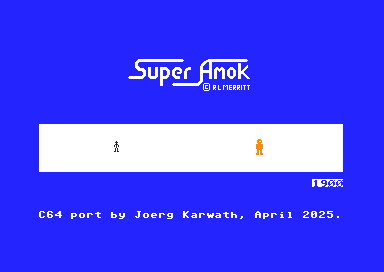
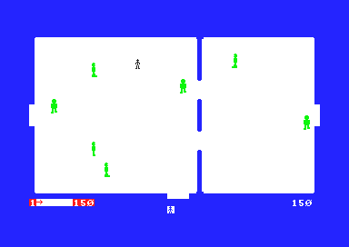
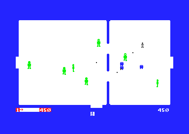
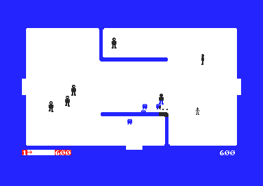
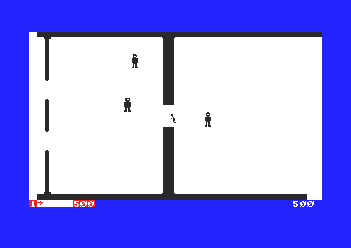

## Super Amok
 

Since finishing the arcade port of Moon Patrol for C64 as Mars Patrol last year I really found out about the very much alive retro scene for the C64 (and other oldies of course).
Because originally my first computer was a VIC-20 in 1982 or 1983 (I don't remember exactly) back then I didn't know much about Assembler or RAM restrictions or sprites. I just wanted to program something with which I could fly over some 3D terrain. Yeah... reality check came quickly :-)
I got a bunch of 3.5kB programs on tape, e.g. Skramble and Amok. And Amok had these fantasticly moving robots and player. And you could shoot and everything was smooth.
And my friend Muli and myself was wondering, how the hell did they do this? And then we found out that you could setup and design your own character fonts and so create the game graphics! But how did they do the pixel movements? Muli showed me a concept of moving an alien spaceship on paper by using 2 characters and shifting the pixels of one character over to the next one! That was the trick! But ... we never did it. Very soon after we both switched to a C64 and never touched the concept of Soft Sprites again.

After doing Mars Patrol I played around with a hardware sprite multiplexer and then got interested in doing it with soft sprites via characters. Not so simple, quite challenging actually, and after multiple attempts I had something of a working soft sprite library.
Here I remembered the VIC-20 Amok version and the later 8k-Cartridge version Super Amok.

So here is my port of Super Amok to C64 by using software sprites only. Great respect to Roger Merrit the original author of this game who did it in just 8K! And did a better job than myself here - like 42 years earlier! Absolutely Amazing!

I ripped the graphics from the ROM file, so it pretty much looks like the original. All the gameplay is the same. I tried really hard to make it as close to the VIC-20 game as possible.
For the sound effects I used a SFX sound driver by 4mat. And please forgive my non-existent skills on the SID.

This was a fun project indeed.  
And I already have an idea to do the soft sprites part better, let's see if there will be another version of Super Amok, or something new? Hey, Lemmings would be the ultimate challenge (huge respect to Thomas Mittelmeyer, the developper back in 1994!!!)

**Have fun!**  
(April 2025)

    
